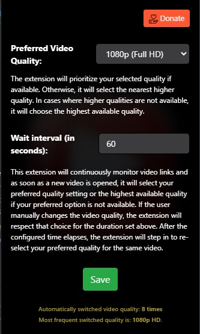

# Auto_Max_Quality_Pro

A browser extension designed to automatically switch YouTube & Other videos to the highest available quality.

## Installation

Click the badge above to install the extension from the Chrome Web Store.

## Directory Structure

Here's an overview of the directory structure:

- `media/`: Contains all the media files, including icons.
- `scripts/`: Contains the JavaScript files.
- `styles/`: Contains stylesheets.
- `html/`: Contains the HTML files like `popup.html`.

Please ensure that you place files in the appropriate directories when contributing.

## Commit Message Guidelines

To ensure consistency across commits and facilitate automation tasks, such as auto-version bumping, we have established
specific guidelines for commit messages. Each commit message should begin with one of the following keywords to
accurately describe the nature of the update:

- `Major Update: ` - Substantial new features or modifications.
- `Minor Update: ` - Smaller feature additions, enhancements, or adjustments.
- `Documentation Update: ` - Changes to documentation or this README.
- `Bug Fix: ` - Rectifies a bug.
- `Security Fix: ` - Addresses a security risk.
- `Build: ` - Pertains to the build process.
- `CI: ` - Refers to the Continuous Integration process modifications.
- `Revert ` - Reverses a previous commit.
- `Release: ` - Signifies a new release.
- `Merge ` - Involves merging branches.
- `Hotfix: ` - Quick solutions for pressing issues.
- `New Feature: ` - Adds entirely new functionality.
- `Improvement: ` - Enhances current functionalities.
- `Performance: ` - Optimizes extension performance.
- `Style: ` - Changes that are purely cosmetic.
- `WIP: ` - Denotes work in progress.

## Automated Versioning

Our repository employs a GitHub Actions workflow that automates versioning within our `manifest.json`. This automation
bases its version adjustments on the patterns identified in commit messages:

- **Major Version Bump (e.g., `1.x.y` to `2.0.0`)**:
  Initiated by commit messages containing the following:
    - `Release: `
    - `Major Update: `

- **Minor Version Bump (e.g., `1.1.y` to `1.2.0`)**:
  This can be triggered by several commit messages including:
    - `Minor Update: `
    - `New Feature: `
    - `Improvement: `
    - `Performance: `
    - `Bug Fix: `
    - `Security Fix: `
    - `Hotfix: `

- **Patch Version Bump (e.g., `1.2.10` to `1.2.11`)**:
  Triggered by other commit messages such as:
    - `Documentation Update: `
    - `Build: `
    - `CI: `
    - `Style: `

By automating the versioning process, we can consistently maintain version records, decrease the potential for human
errors, and offer a clear understanding of the changes and their significance in each release. When contributing, it's
essential to ensure that your commit messages align with the provided guidelines, enabling the correct version bump to
occur.

Kindly adhere to these guidelines for seamless automation and a comprehensive commit history.